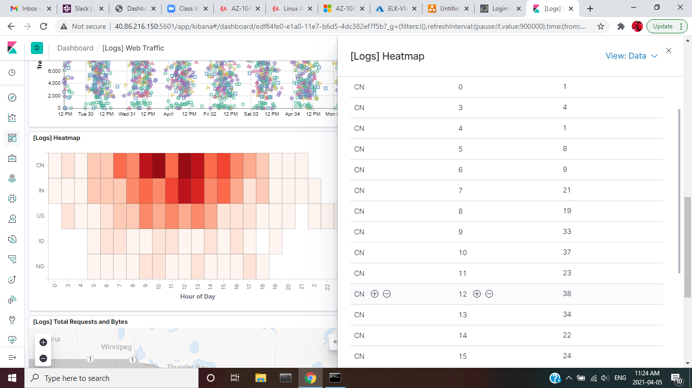
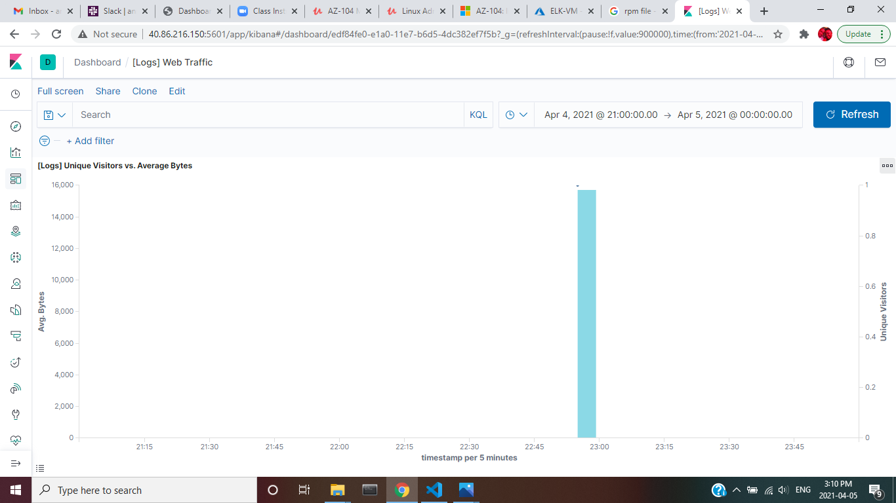
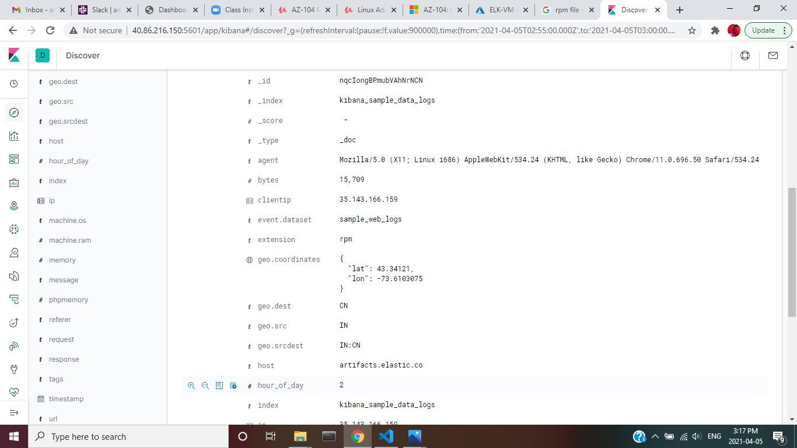
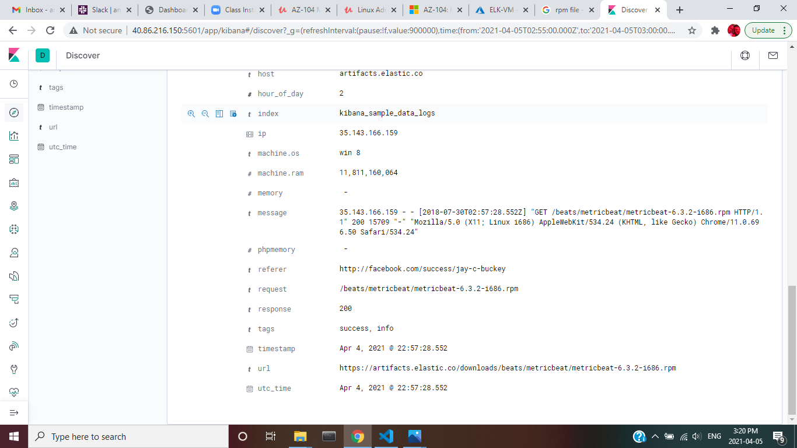
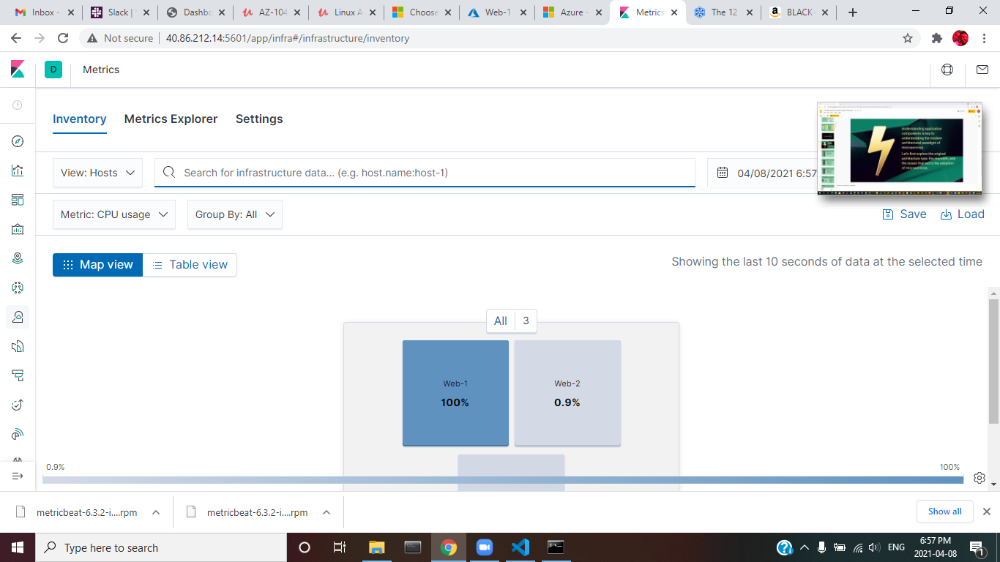
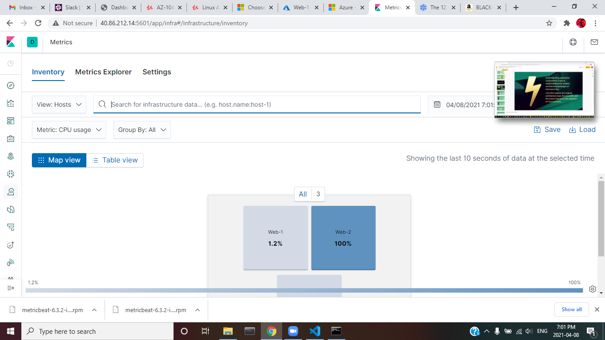
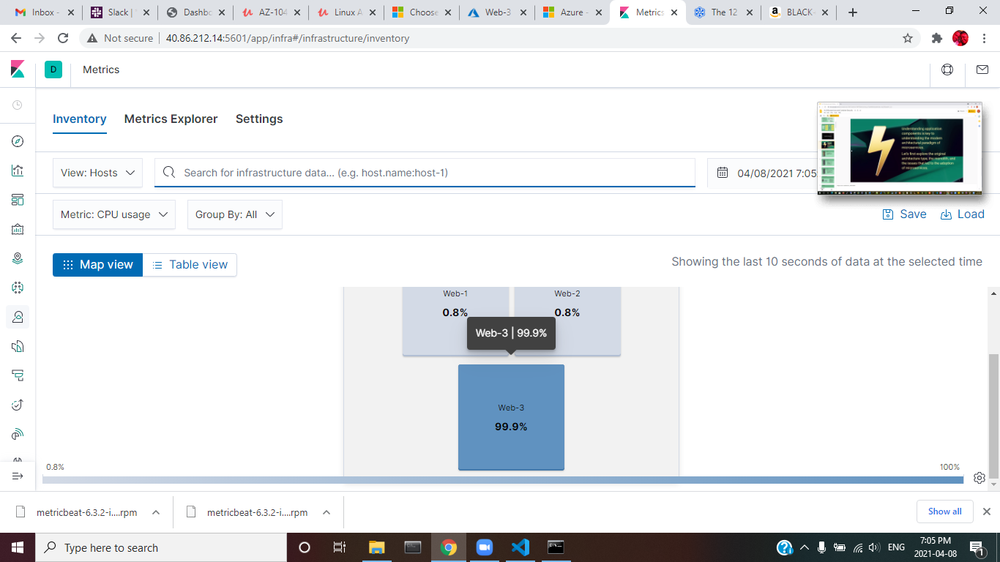
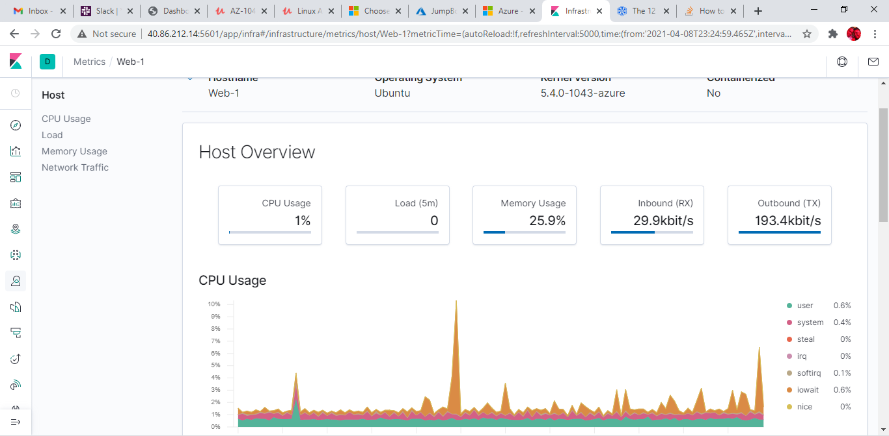
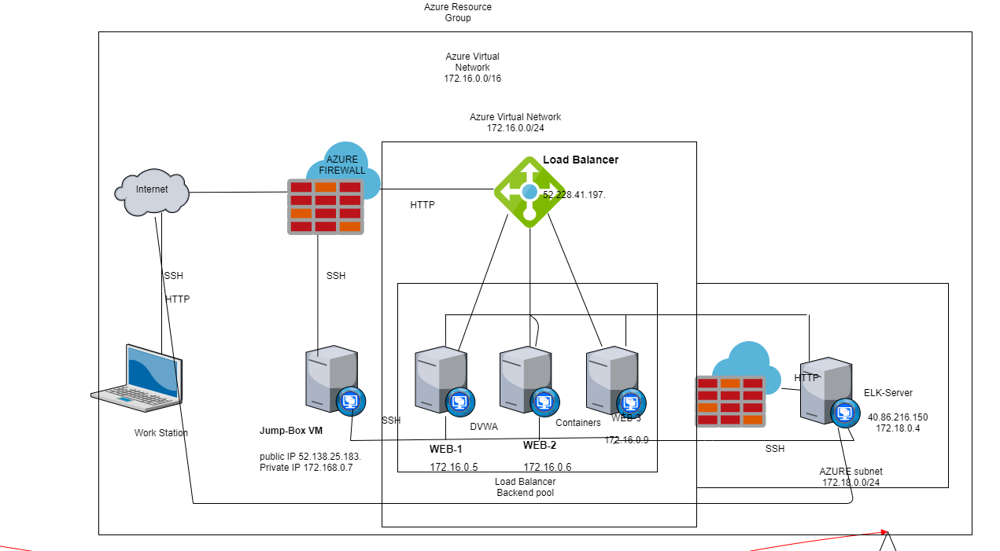
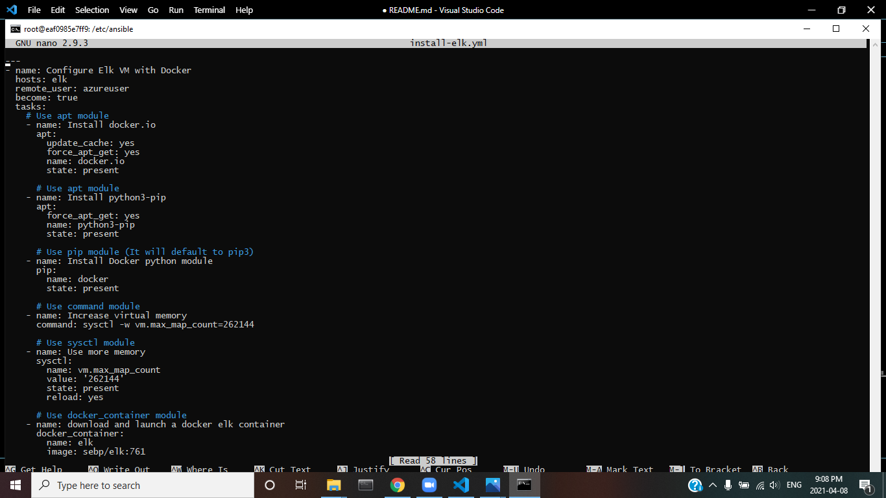

## ELK_STACK_PROJECT

In the ELK_STACK_PROJECT we set up 3 VM's, a JumpBox and ELK server Machine to be able to get the log data from the 3 VM Machines and analyse the LOG Data

 We started by creating 3 VM's (WEB-01, WEB-02, WEB-03), then created a new VNET, in the same resource group (This shows that the resources all belong to the same group and makes billing easy), we then created VNET peering and this is the connection between the 2 VNET's that we created.
 We had the subnet of the first VNET as 172.16.0.0/24 and the second VNET as 172.18.0.0/24

 In the Second VNET, we used the VM with RAM of 4 or More GB and to be able to handle the gathering of the Log files and enable us to analyse them and this is the ELK-Server

 With the Network Sorted, we have our network as below

 

 We then configured the Container, by adding the VM's to the ansible 'hosts' file, then creating a playbook to install and configure the docker then run the playbook to launch the container

Verified that the ELK Container is running 

We then confirmed the ELK Server was running the Kibana to be able to view and analyse the log data

We then deployed Filebeat and MetricBeat Using Ansible to ensure that the log data is continuously received from the 3 Web VM's and we could be able to analyse this data

After the files had been uploaded on Kibana, we have the log files listed as showm

We then Analysed the Log Files Starting with the web traffic Log and Answered the questions that we were asked

In the last 7 days, we had 227 Unique Visitors Located in India 

The Visitor's From China Using Mac OSX were 15

The Percentage of visitors that received 404 and 503 Errors were 6.667% and 2.667% respectively

In the last 7 days the country that produced the majority of the traffic was China

The traffic from China was highest at noon 

Types of files that have been downloaded are 
gz file - GNU Compressed Zip
CSS -Cascading Style Sheet
ZIP - Acrhive File Format
deb - Unix Archive Format
rpm - Red Hat Package Management file that stores installation packages for redhat

The Time stamp with the most amount of Bytes 

Its strange because at this time, the number of files that we downloaded doubled, when we analysed this data further, using the discover of Kibana, it occurred on Apr 4, 2021 @ 22:57:28.552, it was a document file and it originated from India and received a response code of 200

The source IP, geo coordinates, source machine and the full url plus website the the visitors traffic originated are as follows

source IP - 35.143.166.159
geo coordinates - {
  "lat": 43.34121,
  "lon": -73.6103075
}

Full url - https://artifacts.elastic.co/downloads/beats/metricbeat/metricbeat-6.3.2-i686.rpm

Source Machine - 35.143.166.159

From My insights I think the user was viewing and downloading photos from facebook, and the file was not malicious and it's large that's why it was flagged. The person was able to access the information as a http 200 indicates that the information was successfuly downloaded

With the Kibana extended, I was able to do some extra analyis on the machine, I logged into the jump-box and created a bash scripts to have continous failed login attempts to be able to generate the date to analyze off Kibanda

we used the script

#!/bin/bash

for ((n=0;n<50;n++))
do
 ssh -i mutaawe2 azureuser@172.16.0.5
 ssh -i mutaawe2 azureuser@172.16.0.6
 ssh -i mutaawe2 azureuser@172.16.0.9
done

Running the scripts 50 times to have sufficient data for the analysis I was able to view the failed login attemtpts as shown

this is seen on the line that has the system.auth dropped connections

I was able to view the CPU usage change as we run the stress command and saw this change the metrics of the machine

we run the wget command to generate many web requests with this for loop

#!/bin/bash

for ((n=0;n<50;n++))
do
 wget 172.16.0.5
done

then I logged into the metrics on Kibana and noticed 

## Automated ELK Stack Deployment

The files in this repository were used to configure the network depicted below.

**Note**: The following image link needs to be updated. Replace `diagram_filename.png` with the name of your diagram image file.  

These files have been tested and used to generate a live ELK deployment on Azure. They can be used to either recreate the entire deployment pictured above. Alternatively, select portions of the playbook file may be used to install only certain pieces of it, such as Filebeat.

  - _TODO: Enter the playbook file._

  

This document contains the following details:
- Description of the Topologu
- Access Policies
- ELK Configuration
  - Beats in Use
  - Machines Being Monitored
- How to Use the Ansible Build

### Description of the Topology

The main purpose of this network is to expose a load-balanced and monitored instance of DVWA, the D*mn Vulnerable Web Application.

Load balancing ensures that the application will be highly available/scalable, in addition to restricting Distributed Denial of Service to the network.

The Jump box is used to access and manage devices and is usually in a seperate zone to enhance security

- _TODO: What aspect of security do load balancers protect? What is the advantage of a jump box?_

Integrating an ELK server allows users to easily monitor the vulnerable VMs for changes to the logfiles and system metrics.

Filebeat monitors logfiles and sends them to elastic search, so we are able to view any suspicious activity while the metricbeat monitors the device system for changes in the CPU, Network, Load and Memory

- _TODO: What does Filebeat watch for?_
- _TODO: What does Metricbeat record?_

The configuration details of each machine may be found below.
_Note: Use the [Markdown Table Generator](http://www.tablesgenerator.com/markdown_tables) to add/remove values from the table_.

| Name     | Function | IP Address | Operating System |
|----------|----------|------------|------------------|
| Jump Box | Gateway  | 172.16.0.7   | Linux            |
| Web-01   | VM (host) | 172.16.0.5  | Linux                 |
| Web-02   | VM (host) |  172.16.0.6 |  Linux                |
| web-03   | VM (host) | 172.16.0.9  |   Linux               |

### Access Policies

The machines on the internal network are not exposed to the public Internet. 

Only the Jump Box machine can accept connections from the Internet. Access to this machine is only allowed from the following IP addresses:
- _My IP address that i set in the NSG (69.156.55.223) and through the public ip of the Jumpbox 52.138.25.183

Machines within the network can only be accessed by SSH/HTML.

I allowed my machine and to access the ELK VM and my IP address was 69.156.55.223
- _TODO: Which machine did you allow to access your ELK VM? What was its IP address?_

A summary of the access policies in place can be found in the table below.

| Name     | Publicly Accessible | Allowed IP Addresses |
|----------|---------------------|----------------------|
| Jump Box | Yes/No              | 172.16.0.7 52.138.25.183   |
| ELK-VM   | Yes                 |  69.156.55.223                    |
|          |                     |                      |

### Elk Configuration

Ansible was used to automate configuration of the ELK machine. No configuration was performed manually, which is advantageous because...
- _The main advantage of Autamation is the ease with which we can make this instead of installing these files indicidually on many machines and this reduces the errors that we will be making

The playbook implements the following tasks:
Installs docker.io
Installs python3-pip
Installs python modules
Increases the memory so the machine runs with ease
Downloads and launches the elk container

- _TODO: In 3-5 bullets, explain the steps of the ELK installation play. E.g., install Docker; download image; etc._
- ...
- ...

The following screenshot displays the result of running `docker ps` after successfully configuring the ELK instance.

**Note**: The following image link needs to be updated. Replace `docker_ps_output.png` with the name of your screenshot image file.  

### Target Machines & Beats
This ELK server is configured to monitor the following machines:
- _TODO: WEB-01 172.16.0.5, WEB-02 172.16.0.6, WEB-03 172.16.0.9

We have installed the following Beats on these machines:
- _TODO: Specify which Beats you successfully installed_

These Beats allow us to collect the following information from each machine:

FileBeat Collects, Log Files and used to track user log in files 
MetricBeats Collects. CPU Usage, Network Traffic, Memory and Load and used to track the status of the system
- _TODO: In 1-2 sentences, explain what kind of data each beat collects, and provide 1 example of what you expect to see. E.g., `Winlogbeat` collects Windows logs, which we use to track user logon events, etc._

### Using the Playbook
In order to use the playbook, you will need to have an Ansible control node already configured. Assuming you have such a control node provisioned: 

ansible all -m ping

Determined that the connections to all the nodes was up and running

SSH into the control node and follow the steps below:
- Copy the playbook.yml file to /etc/ansible.
- Update the _____ file to include...

Included the plain .yml file and set the file directory so that after the installation the file is availble

Run the playbook and navigated to http://40.86.212.14:5601/app/kibana#/home and confirmed the Kibana was working
- Run the playbook, and navigate to ____ to check that the installation worked as expected.

_TODO: Answer the following questions to fill in the blanks:_
- _Which file is the playbook? Where do you copy it?_
- _Which file do you update to make Ansible run the playbook on a specific machine? How do I specify which machine to install the ELK server on versus which to install Filebeat on?_
- _Which URL do you navigate to in order to check that the ELK server is running?

_As a **Bonus**, provide the specific commands the user will need to run to download the playbook, update the files, etc._
